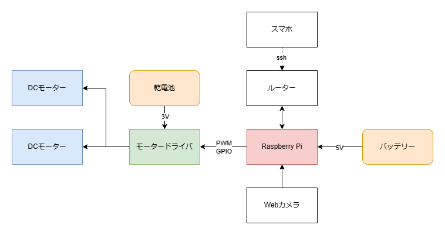
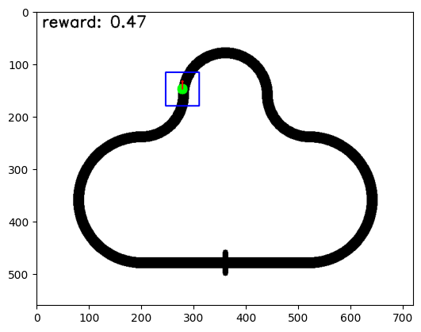

# このリポジトリについて
[DrQ-v2](https://github.com/facebookresearch/drqv2)を用いてWebカメラから取得した画像を観測とするライントレースを行うプログラムです。  
ラズベリーパイ5上で動作させることを想定しています。

# アクチュエータ，センサーについて
アクチュエータは[タミヤのウォームギヤーボックスHE](https://www.tamiya.com/japan/products/72004/index.html)使います。  
センサーはロジクールのWebカメラを使います。  
モータードライバは[TB628A4 6612FNG](https://toshiba.semicon-storage.com/jp/semiconductor/product/motor-driver-ics/brushed-dc-motor-driver-ics/detail.TB6612FNG.html)を使います。


# 強化学習について
### 強化学習とは？
強化学習は、エージェント（意思決定を行う主体）が環境との相互作用を通じて、試行錯誤しながら最適な行動を学ぶ機械学習の一分野です。

### 基本的な要素
強化学習にはいくつかの基本的な要素があります：

1. **エージェント (Agent)**：
   - これは学習を行う主体です。エージェントは、どの行動を取るべきかを学びます。

2. **環境 (Environment)**：
   - エージェントが相互作用する対象です。例えば、ロボットにとっての環境は部屋や工場のような物理的な空間です。

3. **観測 (Observation)**：
   - エージェントが環境から受け取る情報です。例えば、ロボットがカメラで撮影した画像やセンサーからのデータが観測です。

4. **行動 (Action)**：
   - エージェントが選択して取る一連の動きや決定です。例えば、ロボットが前に進む、右に曲がるといった動作が「行動」です。

5. **報酬 (Reward)**：
   - エージェントが取った行動に応じて環境から受け取る評価値です。エージェントの目標は、累積報酬を最大化することです。

### 学習のプロセス
強化学習の学習プロセスは以下のような流れです：

1. **初期状態の観察**：
   - エージェントは環境の現在の状態を観察します。

2. **行動の選択**：
   - エージェントは現在の状態に基づいて行動を選びます。この選択は、エージェントが持つ「方策（Policy）」に基づきます。

3. **行動の実行**：
   - エージェントは選んだ行動を実行します。

4. **報酬の受け取りと次の状態の観察**：
   - 行動の結果として、エージェントは報酬を受け取り、次の状態を観察します。

5. **学習（更新）**：
   - エージェントは得られた報酬と次の状態を基にモデルを更新します。これにより、将来の報酬を最大化するための最適な行動を学習します。


# ソフトウェア全体について
ソフトウェアは学習段階と実行段階に分けて考えることができます。
### 学習段階
学習段階ではシミュレータを用いて強化学習モデルの学習を行います。   
実際に実行するプログラムは[my_train.py](drqv2/my_train.py)に実装してありますが，これはあまり重要ではないので理解する必要はありません。  
`my_train.py`は[drqv2.py](drqv2/drqv2.py)からAgentを，[my_simulator.py](drqv2/my_simulator.py)から環境を呼び出して学習を行います。  
- **[Agent](drqv2/drqv2.py)**

今回使用するAgentとして用いるDrQ-v2(Data regularized Q v2)は，Q学習をベースにした強化学習アルゴリズムであり，以下のような特徴があります。
- 画像を観測とすることができる
- 連続値の行動を取ることができる
- DreamerV2程度の性能を持つ

詳細については[論文](https://arxiv.org/abs/2107.09645)を参照してください。

- **[環境](drqv2/my_simulator.py)**

強化学習用の環境はGym形式で実装されています。Gym形式については[このページ](https://developers.agirobots.com/jp/openai-gym-custom-env/)が参考になります。


大まかに言えば，ラインを定義してからそれをもとに画像を作成し，ロボットの位置をもとに画像の一部を切り取って観測として返します。  
コード内にコメントを書いてあるので，参考にしてください。
### 実行段階
実行段階ではWebカメラから取り込んだ映像を加工して，できるだけシミュレータの観測に似たものを作成し， 学習済みAgentに渡して行動を決定します。  
実際に実行するプログラムは[main.py](drqv2/main.py)に実装してあります。  
`main.py`は[drqv2.py](drqv2/drqv2.py)からAgentを，[my_controller.py](drqv2/my_controller.py)から環境を呼び出して実行します。
- **[Agent](drqv2/drqv2.py)**  

学習段階で用いたものと同じです。
- **[環境](drqv2/my_controller.py)**  

学習段階と同じくGym形式で実装されています。  
Webカメラから取得した画像を観測としてAgentに渡し, Agentからの行動をもとにモーターを制御するコードが実装されています。  
コード内にコメントを書いてあるので，参考にしてください。

# 使い方
### インストール
Ubuntuへのインストールを想定しています。(Windowsならwsl2を使うこと)
```
git clone https://github.com/Azuma413/rl_linetrace.git
python3 -m venv my_env --system-site-packages
pip install -r requirements.txt
```

### 実機動作(ラズパイ上で実行)
windowsのターミナルからssh接続します。
```
ssh raspi3@raspi3.local
sudo ~/my_env/bin/python3 ~/rl_linetrace/drqv2/main.py
```

### 評価(wsl2で実行)
```
cd ~/rl_linetrace/drqv2
source ~/my_env/bin/activate
python my_eval.py
```

### トレーニング(wsl2で実行)
```
cd ~/rl_linetrace/drqv2
source ~/my_env/bin/activate
python train.py
```